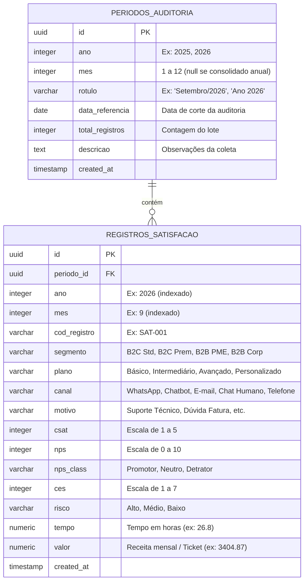

# 📐 Planejamento Estratégico: Conexão com Banco de Dados Gratuito e Análise Multitemporal (Anual / Mensal)

> **Documento de Especificação e Roteiro de Execução**  
> **Status**: Planejado para implementação futura  
> **Projeto**: Dashboard Executivo de CX - Auditoria de Satisfação e Risco de Churn  
> **Arquivo Alvo**: [`index.html`](./index.html)  

---

## 📌 1. Visão Geral e Objetivos

O objetivo deste projeto é equipar o [`index.html`](./index.html) com uma **ligação direta a um banco de dados gratuito na nuvem**, eliminando a dependência de dados estáticos engessados no código-fonte. O banco de dados centralizará todas as informações importadas de planilhas periódicas, permitindo que a mesma auditoria analítica (NPS Metodológico, CSAT, Tempo de Resolução Mediano, Risco de Churn, Gargalos por Canal e Assimetria Financeira) seja executada de forma recorrente em **épocas diferentes**, com flexibilidade de alternância entre **granularidade anual e mensal**.

### Requisitos Principais:
1. **Banco Gratuito na Nuvem**: Sem custos de hospedagem, com suporte a chamadas diretas do navegador sem necessidade de backend intermediário.
2. **Análise Multitemporal Dual (Anual e Mensal)**:
   - **Visão Mensal**: Auditoria de um mês isolado (ex: Setembro/2026) e comparação contra o mês anterior (*Month-over-Month - MoM*).
   - **Visão Anual**: Auditoria consolidada de todos os registros de um ano (ex: 2026) e comparação contra o ano anterior (*Year-over-Year - YoY*).
3. **Importação Contínua de Planilhas (`.xlsx` e `.csv`)**: Interface de upload intuitiva (drag-and-drop) onde o usuário carrega novos lotes de auditoria, define o ano e o mês de competência, e os dados são gravados no banco.
4. **Contingência Offline / Modo Demonstração**: Se não houver internet ou se as chaves do banco ainda não tiverem sido configuradas, o sistema deve recorrer automaticamente a um cache local/dados pré-carregados, garantindo que o dashboard nunca quebre.

---

## 🗄️ 2. Escolha Tecnológica: Supabase (PostgreSQL)

Para conexão direta e gratuita a partir do navegador via HTML/JavaScript, o **Supabase** é a plataforma recomendada.

### Por que o Supabase?
- **Plano Gratuito Generoso**:
  - Banco de dados PostgreSQL dedicado de **500 MB** (capacidade para mais de 500.000 registros de auditoria).
  - 50.000 usuários ativos mensais e 5 GB de largura de banda.
  - Sem custos de cobrança surpresa (o plano gratuito simplesmente pausa se atingir o teto, sem debitar cartão).
- **Acesso Direto do Frontend via CDN**:
  - Utilização da biblioteca oficial `@supabase/supabase-js@2` carregada diretamente no `<head>` via CDN (`jsdelivr`).
- **Segurança Nativa (Row Level Security - RLS)**:
  - Utilização da chave pública anônima (`anon key`), permitindo leitura e inserção controladas no banco a partir do navegador com total conformidade de segurança.

---

## 🏗️ 3. Modelagem de Dados e Esquema Relacional

O esquema foi projetado para desacoplar os lotes de auditoria (períodos) dos registros individuais de clientes, indexando por **Ano** e **Mês**.



---

## 💻 4. Script SQL para Criação do Banco de Dados

Este script deve ser executado no **SQL Editor** do painel do Supabase durante a configuração inicial:

```sql
-- 1. Habilitar extensão para geração de UUIDs
CREATE EXTENSION IF NOT EXISTS "uuid-ossp";

-- 2. Tabela de Períodos de Auditoria (Épocas)
CREATE TABLE IF NOT EXISTS public.periodos_auditoria (
    id UUID PRIMARY KEY DEFAULT uuid_generate_v4(),
    ano INTEGER NOT NULL,
    mes INTEGER CHECK (mes >= 1 AND mes <= 12),
    rotulo VARCHAR(100) NOT NULL,
    data_referencia DATE DEFAULT CURRENT_DATE,
    total_registros INTEGER DEFAULT 0,
    descricao TEXT,
    created_at TIMESTAMP WITH TIME ZONE DEFAULT timezone('utc'::text, now())
);

-- Índices para buscas temporais rápidas
CREATE INDEX IF NOT EXISTS idx_periodos_ano_mes ON public.periodos_auditoria(ano, mes);

-- 3. Tabela de Registros de Satisfação e Atendimento
CREATE TABLE IF NOT EXISTS public.registros_satisfacao (
    id UUID PRIMARY KEY DEFAULT uuid_generate_v4(),
    periodo_id UUID REFERENCES public.periodos_auditoria(id) ON DELETE CASCADE,
    ano INTEGER NOT NULL,
    mes INTEGER CHECK (mes >= 1 AND mes <= 12),
    cod_registro VARCHAR(50) NOT NULL,
    segmento VARCHAR(50) NOT NULL,
    plano VARCHAR(50) NOT NULL,
    canal VARCHAR(50) NOT NULL,
    motivo VARCHAR(100),
    csat INTEGER CHECK (csat >= 1 AND csat <= 5),
    nps INTEGER CHECK (nps >= 0 AND nps <= 10),
    nps_class VARCHAR(20) CHECK (nps_class IN ('Promotor', 'Neutro', 'Detrator')),
    ces INTEGER CHECK (ces >= 1 AND ces <= 7),
    risco VARCHAR(20) CHECK (risco IN ('Alto', 'Médio', 'Baixo')),
    tempo NUMERIC(6,2),
    valor NUMERIC(10,2),
    created_at TIMESTAMP WITH TIME ZONE DEFAULT timezone('utc'::text, now())
);

-- Índices de consulta para os filtros do dashboard
CREATE INDEX IF NOT EXISTS idx_registros_ano_mes ON public.registros_satisfacao(ano, mes);
CREATE INDEX IF NOT EXISTS idx_registros_segmento ON public.registros_satisfacao(segmento);
CREATE INDEX IF NOT EXISTS idx_registros_plano ON public.registros_satisfacao(plano);
CREATE INDEX IF NOT EXISTS idx_registros_canal ON public.registros_satisfacao(canal);

-- 4. Habilitar Políticas de Segurança (Row Level Security - RLS)
ALTER TABLE public.periodos_auditoria ENABLE ROW LEVEL SECURITY;
ALTER TABLE public.registros_satisfacao ENABLE ROW LEVEL SECURITY;

-- Política de Leitura Pública para a aplicação web
CREATE POLICY "Permitir leitura pública de períodos" 
ON public.periodos_auditoria FOR SELECT USING (true);

CREATE POLICY "Permitir leitura pública de registros" 
ON public.registros_satisfacao FOR SELECT USING (true);

-- Política de Inserção via chave anônima (para o importador da web)
CREATE POLICY "Permitir inserção de períodos via app" 
ON public.periodos_auditoria FOR INSERT WITH CHECK (true);

CREATE POLICY "Permitir inserção de registros via app" 
ON public.registros_satisfacao FOR INSERT WITH CHECK (true);
```

---

## 🎨 5. Especificação das Modificações na Interface (`index.html`)

### A. Cabeçalho Executivo
- **Indicador de Status do Banco**:
  - `🟢 Supabase Conectado` (clicável para ver credenciais ou alterar projeto).
  - `🟡 Modo Local / Demonstração` (avisa que está rodando sobre dados locais).
- **Botão "+ Importar Planilha"**:
  - Abre modal para envio de arquivo Excel/CSV com carimbo de Ano e Mês.

### B. Barra de Navegação Temporal (Nova Seção de Filtros)
Posicionada logo acima do filtro de produtos:
1. **Interruptor de Modo Temporal**:
   - `[ 📅 Visão Mensal ]` | `[ 📆 Visão Anual ]`
2. **Seletor de Ano**:
   - Dropdown populado dinamicamente com os anos presentes no banco (ex: `2026`, `2025`, `Todos os Anos`).
3. **Seletor de Mês** (visível quando o modo for "Mensal"):
   - Dropdown com meses disponíveis (ex: `Setembro`, `Agosto`...).
4. **Resumo Contextual do Período**:
   - Badge com o universo da época: *"Exibindo Auditoria Mensal: **Setembro/2026** (100 registros)"*.

### C. Modais Interativos

#### 1. Modal de Conexão com o Banco de Dados
- Campos:
  - `Supabase Project URL` (ex: `https://xyzproject.supabase.co`)
  - `Supabase Public Anon Key` (chave pública da API)
- Ações:
  - Botão **"Testar Conexão"**: valida a conectividade em tempo real.
  - Botão **"Salvar no Navegador"**: salva no `localStorage` do usuário para não precisar redigitar.
  - Botão **"Copiar Script SQL"**: copia o script de criação das tabelas para colar no painel do Supabase.
  - Botão **"Carregar Base Baseline (Set/2026)"**: insere os 100 registros iniciais no banco com 1 clique.

#### 2. Modal de Importação de Planilha (`SheetJS`)
- Incluir `https://cdn.jsdelivr.net/npm/xlsx@0.18.5/dist/xlsx.full.min.js`.
- Área de *Drag & Drop* para arquivos `.xlsx` e `.csv`.
- Seleção obrigatória:
  - **Ano de Referência**: `[ 2026 ▼ ]`
  - **Mês de Referência**: `[ Outubro ▼ ]`
  - **Rótulo Personalizado**: `Ex: Auditoria Pós-Mudança WhatsApp`
- Prévia em tabela dos primeiros 5 registros detectados e validação das colunas necessárias (`csat`, `nps`, `tempo`, `valor`, etc.).
- Barra de progresso de gravação no Supabase em lotes (*batch insert* de 50 em 50 registros).

### D. Painel de Comparativo Temporal (Deltas MoM e YoY)
Mini-cartões exibidos ao lado dos 4 KPIs para indicar a evolução em relação ao período anterior:
- **NPS**: `Set/26 (-21)` ➔ `▲ +9 vs. Ago/26`
- **CSAT**: `Set/26 (3,19)` ➔ `▼ -0,12 vs. Ago/26`
- **Tempo Mediano**: `Set/26 (26,8h)` ➔ `▼ -2,4h de redução vs. Ago/26`
- **Risco de Churn**: `Set/26 (44%)` ➔ `▼ -4% de melhora vs. Ago/26`

---

## ⚙️ 6. Adaptação do Motor Reativo em JavaScript

Hoje, o `index.html` processa a constante global `RAW_DATA`. O fluxo será atualizado para:

1. **Camada de Carregamento Assíncrono**:
   ```javascript
   let ALL_DATA = []; // Registros completos carregados do Supabase ou do cache local
   let ACTIVE_EPOCH_DATA = []; // Registros filtrados pelo Ano e Mês selecionados
   ```
2. **Ciclo de Filtragem em Duas Etapas**:
   - **Etapa 1 (Temporal)**:
     - Se Modo = `Mês`: filtra `ALL_DATA` onde `d.ano === selectedYear && d.mes === selectedMonth`.
     - Se Modo = `Ano`: filtra `ALL_DATA` onde `d.ano === selectedYear`.
   - **Etapa 2 (Recortes de Negócio)**:
     - Aplica os filtros de `Produto/Plano`, `Segmento` e `Canal` sobre `ACTIVE_EPOCH_DATA`.
   - **Etapa 3 (Renderização)**:
     - Executa o cálculo estatístico (NPS com fórmula metodológica, Mediana de tempo, CSAT e Churn).

---

## 📋 7. Roteiro Passo a Passo para Quando Formos Implementar

Quando for iniciado o desenvolvimento:

- [ ] **Passo 1**: Criar o projeto no [Supabase](https://supabase.com) (gratuito) e executar o script SQL de criação das tabelas.
- [ ] **Passo 2**: Adicionar as dependências de CDN no `<head>` do `index.html` (`@supabase/supabase-js` e `xlsx.full.min.js`).
- [ ] **Passo 3**: Criar o módulo JavaScript de conexão com Supabase (`db_client.js` ou script embutido com fallback para `localStorage`).
- [ ] **Passo 4**: Construir a interface do seletor temporal (botões Mensal/Anual e dropdowns de Ano/Mês) na barra de filtros.
- [ ] **Passo 5**: Construir os modais de **Configuração do Banco** e **Importação de Planilhas**.
- [ ] **Passo 6**: Adaptar a função `renderDashboard()` para integrar o pipeline de dados temporais e calcular os deltas comparativos.
- [ ] **Passo 7**: Testar upload da planilha de 100 registros como Setembro/2026 e uma planilha de teste simulando outro mês/ano.
- [ ] **Passo 8**: Atualizar o `EVOLUCAO_PROJETO.md` para a versão `v3.0.0`.

